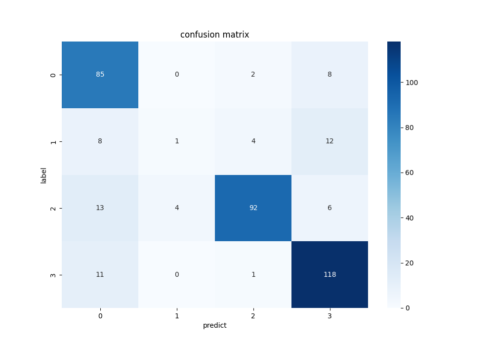
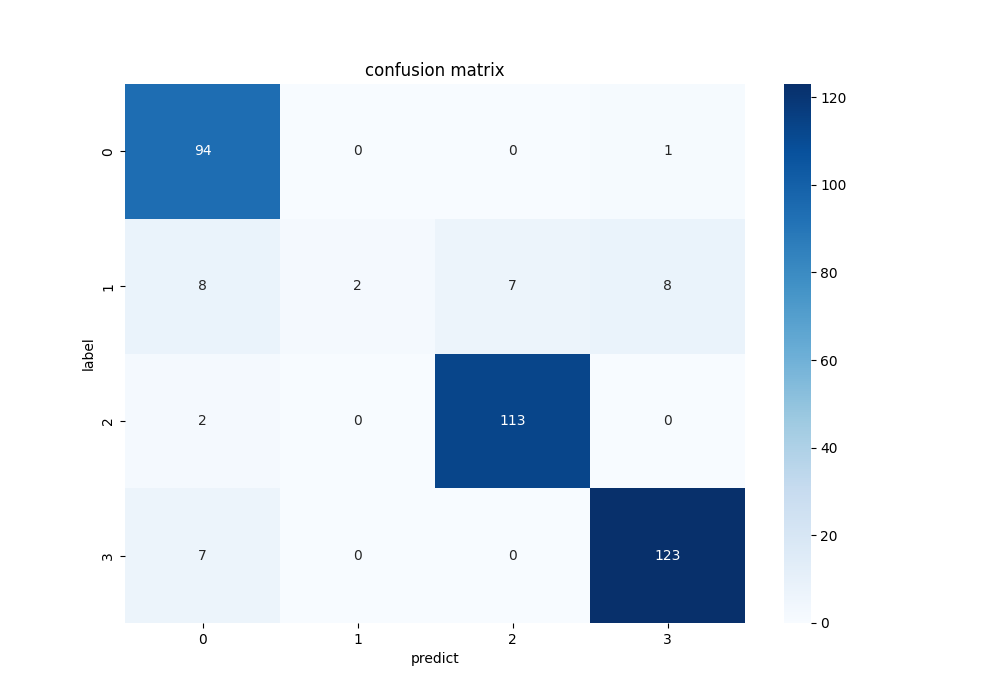

# Plant Pathology 2020 コンペティション

## プロジェクトの概要
このリポジトリは、Kaggleのコンペティション「[Plant Pathology 2020](https://www.kaggle.com/competitions/plant-pathology-2020-fgvc7/overview)」に関するコードを含む。このコンペティションでは、植物の病気を画像から識別するタスクに取り組む。

## データの準備
データはコンペティションのページからダウンロードする。ダウンロードしたデータは以下のディレクトリ構造で配置する。

```markdown
data/
  - images/
    - Train_x.jpg
    - Test_x.jpg
  - train.csv
  - test.csv
```

## 必要なライブラリのインストール

### 仮想環境の作成
```bash
conda create -n pp2020 python=3.10
conda activate pp2020
```

### CUDA Toolkit 11.8 のインストール

```bash
conda install nvidia/label/cuda-11.8.0::cuda-toolkit
```

### PyTorch と関連ライブラリのインストール

```bash
conda install pytorch torchvision torchaudio pytorch-cuda=11.8 -c pytorch -c nvidia
```

### Pandas と Matplotlib のインストール

```bash
pip install pandas matplotlib scikit-learn seaborn
```

## データの分割
Train:Val:Test = 16:4:5になるように分割した

## モデルのアンサンブル
1. **クラスの枚数比**：
   - 各クラスの枚数比は以下の通り：`healthy (H): 516, multiple_diseases (M): 91, rust (R): 622, scrab (S): 592`

2. **データの不均衡問題**：
   - `M` クラスの枚数が他のクラスに比べて非常に少ないことが問題

3. **データセットの調整**：
   - この不均衡を解消するために、`M` クラスをオーバーサンプリングし、他のクラスはアンダーサンプリングしたデータセットでモデルを学習した
   - 異なるサンプリング方法で3つのモデルを学習した

4. **アンサンブルモデルの作成**：
   - 3つの個別モデルを組み合わせ、それぞれの出力をもとに最終的な出力を行うアンサンブルモデルを作成した

## モデルの評価
### 正解率/適合率/再現率/F1値
| モデル/指標        | 訓練時間(分) | 正解率  | 適合率  | 再現率  | F1値   |
|-------------------|---------|---------|--------|--------|--------|
| **転移学習**       |         |        |        |        |        |
| ResNet50          | 7        | 0.8110  | 0.6688 | 0.6606 | 0.6474 |
| Vit-h             | 102      | 0.9151  | 0.8537 | 0.8229 | 0.8340 |
| **アンサンブル**   |         |         |        |        |        |
| lrスケジュールなし | 29       | 0.9095  | 0.9301 | 0.7496 | 0.7404 |
| lrスケジュールあり | 34       | 0.9452  | 0.9568 | 0.8309 | 0.8558 |

### 混同行列
### モデルとその性能グラフ

| モデル                         | 画像                                      |
|-------------------------------|------------------------------------------|
| **ResNet50**                  |          |
| **Vit-h**                     |                  |
| **アンサンブル(lrスケジュールなし)** |         |
| **アンサンブル(lrスケジュールあり)** |  |

